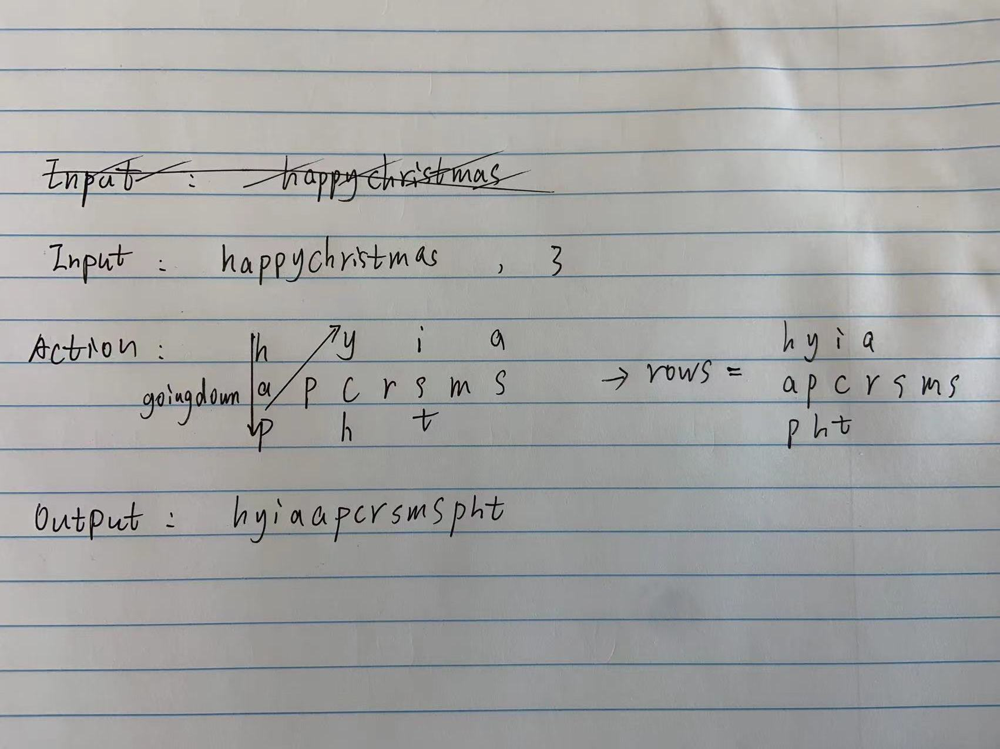

# [6.Zigzag Conversion](https://leetcode.com/problems/zigzag-conversion/)

## Solution
Iterate through s from left to right, appending each character to the appropriate row. The appropriate row can be tracked using two variables: the current row and the current direction. The current direction changes only when we moved up to the top-most row or moved down to the bottom-most row.

```{js}
/**
 * @param {string} s
 * @param {number} numRows
 * @return {string}
 */
var convert = function(s, numRows) 
{
  if (numRows === 1) return s;

  const rows = Array.from({length: numRows}, (v, i) => []) 
    
  let goingDown = false;
  for(let i = 0, r = 0; i < s.length; i++) {
    rows[r].push(s[i])
    if (r === 0 || r === numRows - 1) goingDown = !goingDown;
    r += goingDown ? 1 : -1;
  }
  
  return rows.reduce((acc, item) => {
    acc += item.join("")
    return acc
  }, "")
};

console.log(convert("happychristmas", 3))
```


## Complexity Analysis

* Time Complexity: O(n)       
* Space Complexity: O(n)
